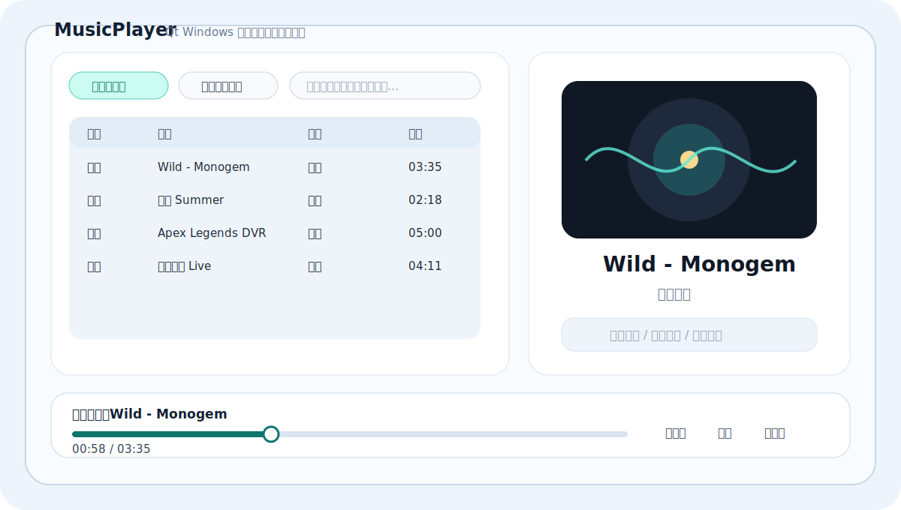
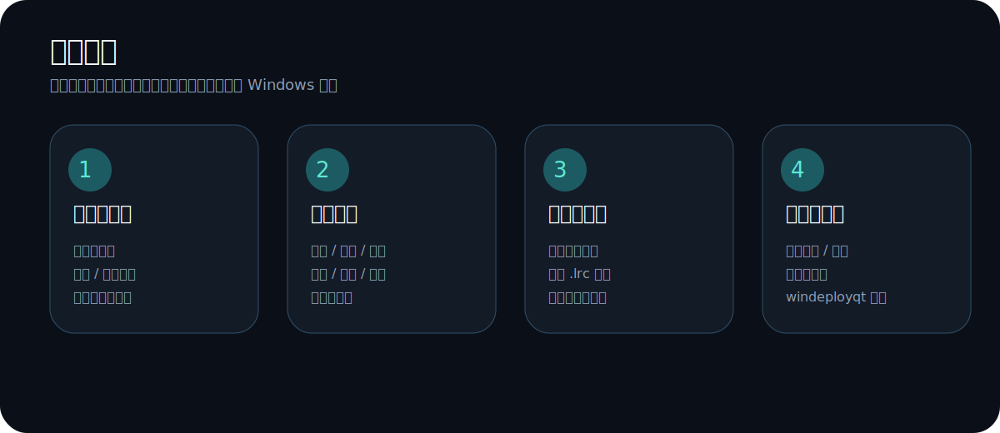
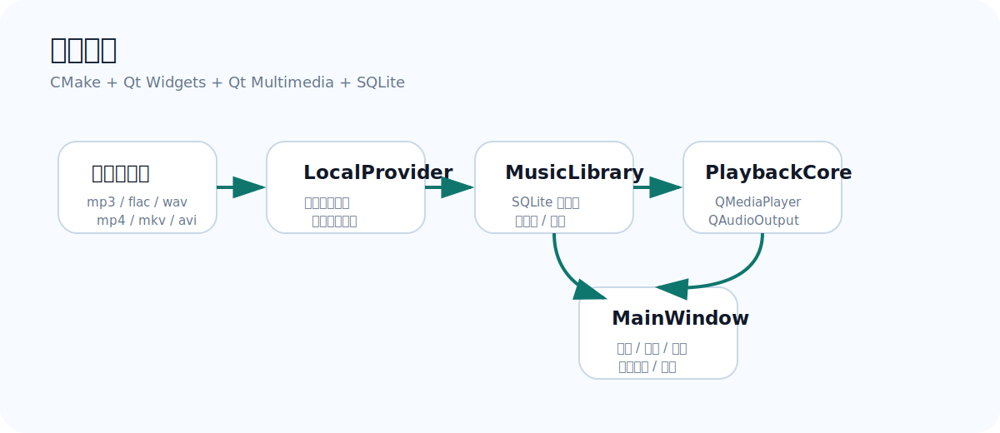

# MusicPlayer

## 数据说明

本项目不会把个人媒体目录、播放记录或本地数据库提交到 GitHub，也不会把这些数据打包进发布压缩包。用户添加的文件夹会保存在当前 Windows 用户的应用数据目录中的 SQLite 数据库里。

为避免开发环境和发布包互相读取同一份本地数据，Debug/VS 运行版继续使用 `wjcCN/MusicPlayer` 数据目录，Release/下载发布版使用独立的 `wjcCN/MusicPlayerRelease` 数据目录。

一个基于 Qt Widgets 的 Windows 本地音乐与视频播放器。项目目标是提供轻量、清晰、可发布的桌面播放器体验：扫描本地文件夹、管理媒体库、播放音频与视频、显示封面与同步歌词，并支持深浅色主题。

<p align="center">
  
</p>

<p align="center">
  <a href="https://github.com/wjcCN/MusicPlayer/releases/tag/v1.0.1"></a>
  
  
  
</p>

## 项目亮点

<p align="center">
  
</p>

- **本地媒体库**：添加文件夹后自动扫描常见音频与视频文件，并支持重新扫描。
- **双视图浏览**：媒体库支持列表视图与图标视图，图标大小可切换。
- **播放控制**：支持播放、暂停、上一首、下一首、进度拖动、音量、顺序播放、循环和随机播放。
- **封面与歌词**：读取音频封面，支持同名 `.lrc` 歌词，并随播放进度自动滚动。
- **视频播放**：支持本地视频播放、全屏播放、仅音频模式和视频缩放模式。
- **快捷操作**：空格暂停/继续，左右方向键快退/快进，视频全屏下 `Esc` 退出。
- **主题与语言**：内置深色/浅色主题，默认中文，可切换英文。
- **Windows 发布**：已使用 `windeployqt` 打包 Qt 运行库与插件，可直接下载 v1.0.1 发布包。

## 下载

当前版本：**v1.0.1**

- [GitHub Release 页面](https://github.com/wjcCN/MusicPlayer/releases/tag/v1.0.1)
- [Windows x64 压缩包](https://github.com/wjcCN/MusicPlayer/releases/download/v1.0.1/MusicPlayer-v1.0.1-windows-x64.zip)

下载后解压，运行 `MusicPlayer.exe` 即可。

## 使用方式

1. 点击 **添加文件夹**，选择存放音乐或视频的本地目录。
2. 在媒体库中双击歌曲或视频开始播放。
3. 使用底部控制栏进行暂停、切歌、拖动进度和调节音量。
4. 对音乐文件，可将同名 `.lrc` 歌词放在媒体文件旁边以启用同步歌词。
5. 对视频文件，可使用缩放模式、仅音频和全屏功能。

## 架构概览

<p align="center">
  
</p>

项目保持 CMake + Qt Widgets 结构，核心模块如下：

```text
include/
  core/        播放控制、歌词解析、媒体数据结构
  data/        SQLite 媒体库与用户设置
  providers/   本地文件提供器
  ui/          主窗口、文件夹管理、全屏视频窗口

src/
  core/
  data/
  providers/
  ui/

resources/
  images/      主题背景、按钮、默认封面
  styles/      Qt QSS 样式
```

## 从源码构建

依赖：

- Windows
- Qt 6.11.1 或兼容 Qt 6 版本
- MSVC 2022 工具链
- CMake 3.16+

示例：

```powershell
cmake -S . -B out/build/release -G Ninja `
  -DCMAKE_BUILD_TYPE=Release `
  -DCMAKE_PREFIX_PATH=D:/Programs/Qt/6.11.1/msvc2022_64

cmake --build out/build/release --config Release --target MusicPlayer
```

发布打包：

```powershell
windeployqt --release --compiler-runtime --dir out/package/MusicPlayer-v1.0.1 `
  out/package/MusicPlayer-v1.0.1/MusicPlayer.exe
```

## 当前状态

v1.0.1 聚焦本地播放器能力，并修复开发版与发布版共用本机数据目录的问题：

- 稳定播放本地音频与视频
- 管理本地媒体库和添加的文件夹
- 展示封面、歌词、播放队列与基础媒体信息
- 提供可下载的 Windows x64 发布包
- Release 发布包使用独立的本机数据目录，避免自动载入开发环境中的个人媒体文件夹

后续可以继续改进：

- 更精细的媒体信息读取
- 更完善的视频播放交互
- 更正式的安装包
- 更丰富的播放列表和收藏管理
